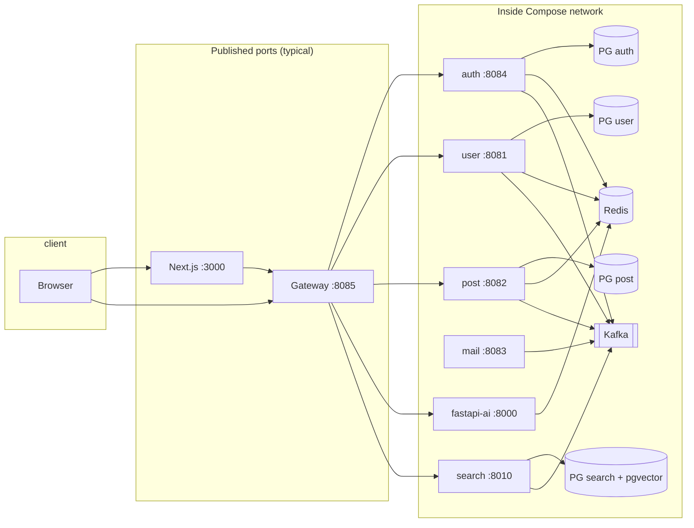

# MSA Blog Platform — Standard Template

<p align="center">
  <a href="README.md">← Hub</a>
  &nbsp;·&nbsp;
  <a href="README.ko.md">한국어 →</a>
</p>

---

## What is this?

An example **microservices blog / content platform** that uses **Spring Cloud Gateway** as the single API entry point, with separate services for auth, users, posts, search, and an AI chatbot. It uses **PostgreSQL** (multiple databases + **pgvector**), **Redis**, and **Kafka (KRaft, no ZooKeeper)**. The frontend is **Next.js (App Router)**. Memory limits are tuned for a **~4 GB VPS** (e.g. Lightsail).

It is meant as an open-source template: **Fork → fill in `.env` → run**.

---

## Tech stack

| Layer | Technology |
|-------|------------|
| API Gateway | Spring Cloud Gateway (WebFlux), JWT check, trace ID |
| Backend | Spring Boot 3 (Auth, User, Post, SMTP), FastAPI (Search, AI) |
| Frontend | Next.js (App Router) |
| Data | PostgreSQL 15 × 4, Redis, Kafka 3.7 KRaft |
| Ops | Docker Compose, GHCR, optional GitHub Actions deploy |

---

## Architecture

The browser talks to **Next.js (3000)**. API traffic goes through the **gateway (8085)**. Internal services use Docker DNS names and are mostly **not** published to the host except where `ports:` is set.



- **mail-service** is **not** routed on the gateway; it works with **Kafka** (e.g. verification email).
- **search-service** consumes post events from Kafka, stores embeddings in pgvector, and serves semantic search APIs.

---

## Features

- **Auth**: email code signup/login, JWT access/refresh, cookie & Bearer, **OAuth2** (Google / Kakao / GitHub when configured), account recovery flows
- **Profile**: nickname checks, “me” APIs (user-service)
- **Posts**: CRUD, list/detail, categories/tags, popular, keyword search, **drafts** and publish
- **Media**: cover image upload
- **Comments**: CRUD + list
- **Visits**: record + stats APIs
- **Semantic search**: `/api/search`, related posts, index sync APIs (via gateway)
- **Chatbot**: FastAPI + Groq (LangChain); requires **`GROQ_API_KEY`**
- **Ops helpers**: autoheal (labelled containers), Kafka UI (`--profile tools`), Fluent Bit / node-exporter hooks for monitoring

---

## API reference (via gateway)

**Local base URL:** `http://localhost:8085`  
The Next app uses `NEXT_PUBLIC_*` to point the browser at the same origin policy you configure.

### Route map

| Prefix | Backend | Notes |
|--------|---------|------|
| `/auth`, `/auth/**` | auth-service (context `/auth`) | Login, signup, tokens, OAuth callbacks |
| `/user`, `/user/**` | user-service | Profile, duplicate checks |
| `/api/posts`, `/api/posts/**` | post-service | Posts, comments, media, visits |
| `/api/post-drafts`, `/api/post-drafts/**` | post-service | Drafts |
| `/chat`, `/chat/**` | fastapi-ai | Chat + health |
| `/api/search`, `/api/search/**` | search-service | Search + index |
| `/actuator/**` | api-gateway | Health (per config) |

### Auth (paths under `/auth` on the gateway)

| Method | Path | Description |
|--------|------|-------------|
| POST | `/auth/send-code`, `/auth/verify-code` | Email verification codes |
| POST | `/auth/signup`, `/auth/login`, `/auth/logout` | Sign up / login / logout |
| POST | `/auth/refresh`, `/auth/extend` | Token refresh / extend |
| GET | `/auth/me` | Current auth info |
| POST | `/auth/find-username/send`, `/auth/find-username/verify` | Find username |
| POST | `/auth/reset-password/send`, `/auth/reset-password/verify` | Reset password |
| * | `/auth/oauth2/**`, `/auth/login/oauth2/**` | OAuth2 (when configured) |

### User (`/user`)

| Method | Path | Description |
|--------|------|-------------|
| GET | `/user/check-username` | Username availability (public) |
| GET | `/user/check-nickname` | Nickname availability (public) |
| GET | `/user/me` | My profile |
| POST | `/user/api/users/nicknames` | Batch nickname lookup |

### Posts

| Method | Path | Description |
|--------|------|-------------|
| GET | `/api/posts` | List (public) |
| GET | `/api/posts/{id}` | Detail (public) |
| GET | `/api/posts/popular`, `/category`, `/tag`, `/search` | Filters / search |
| GET | `/api/posts/categories`, `/tags` | Taxonomy |
| POST/PUT/DELETE | `/api/posts`, `/api/posts/{id}` | Mutations (auth) |
| POST | `/api/posts/media/upload` | Cover upload |
| POST | `/api/posts/visits/record`, GET `/api/posts/visits/stats` | Visits |
| GET/POST | `/api/posts/{postId}/comments` | Comments |
| PUT/DELETE | `/api/posts/comments/{commentId}` | Edit/delete comments |
| * | `/api/post-drafts/**` | Draft CRUD + publish |

### Search (`/api/search`)

| Method | Path | Description |
|--------|------|-------------|
| GET | `/api/search?q=` | Semantic search |
| GET | `/api/search/related?post_id=` | Related posts |
| POST | `/api/search/index` | Upsert embedding index |
| DELETE | `/api/search/index/{post_id}` | Remove from index |

### Chat (`/chat`)

| Method | Path | Description |
|--------|------|-------------|
| GET | `/chat/health` (or proxied `/health`) | Health |
| POST | `/chat` | Chat payload per FastAPI schema |

### JWT & public paths

The gateway allows **some routes without a token** (login, public post reads, search, chat, etc.). Protected write APIs need **`Authorization: Bearer`** or the **`authToken`** cookie. See `JwtValidationGlobalFilter` `PUBLIC_PATTERNS` in code for the exact regex list.

There is no single bundled OpenAPI for the whole system; the gateway only **routes by prefix** as above.

---

## Run it after a fork

### Prerequisites

- Docker Desktop or Docker Engine + **Compose V2** (`docker compose`)
- **≥ 4 GB RAM** recommended for the full stack

### 1) Clone

```bash
git clone https://github.com/YOUR_USERNAME/YOUR_REPO.git
cd YOUR_REPO
```

### 2) Environment

```bash
bash scripts/init-env.sh
```

- Copies `.env.example` → `.env` at repo root  
- Copies `frontend/nextjs-app/.env.production.example` → `.env.production` if missing  

Edit `.env` — at minimum set strong values for:

- `POSTGRES_PASSWORD`, `JWT_SECRET`
- Local dev: `CORS_ALLOWED_ORIGINS`, `FRONTEND_URL`, `NEXT_PUBLIC_*` (defaults target localhost)
- Optional: `OAUTH2_*`, `MAIL_*`, `GROQ_API_KEY`

Full key list: **`.env.example`**.

### 3) Start the stack (local image build)

```bash
chmod +x scripts/*.sh   # optional
bash scripts/local-up.sh
```

- App: **http://localhost:3000**  
- Gateway: **http://localhost:8085**

### 4) Frontend-only dev (`npm run dev`)

Keep backends in Docker, then:

```bash
cd frontend/nextjs-app
cp .env.example .env.local
npm ci && npm run dev
```

See comments in `.env.example` for `GATEWAY_INTERNAL_URL`.

### 5) Do not commit secrets

`.env`, keys, `data/`, `**/target/`, `node_modules/`, `.next/` are in **`.gitignore`**. Run `git status` before every commit.

---

## CI/CD (GitHub Actions → GHCR → server)

- Workflow: **`.github/workflows/deploy.yml`**
- On push to **`main` / `master`**: only **changed** app images are built; the rest are **retagged** on GHCR from the previous commit SHA to the new SHA (`scripts/ci-retag-unchanged-images.sh`). Changes to `docker-compose.yml` or `.github/workflows/*` trigger a **full** build of all eight images.
- **paths-ignore:** pushes that touch only `**.md` (anywhere), `LICENSE`, or anything under `docs/**` **do not** run the workflow.
- **Manual full rebuild:** Actions → **Build and deploy** → *Run workflow* → **build_mode = full**.
- Job **timeout: 5 hours** (300 minutes); SSH deploy step **command_timeout: 300m**.
- Secrets: `ENV_VARS`, `HOST`, `USERNAME`, `KEY`, optional `DEPLOY_PATH`

**Images built on your laptop are not deployed automatically.** Deployment uses **cloud builds** triggered by **git push**.

More detail: **`docs/로컬-실행-및-배포-가이드.md`**, **`docs/서버-재배포-및-Docker정리.md`**, **`docs/GitHub-공개저장소-CI-CD-가이드.md`**

Server cleanup script: **`scripts/server-docker-cleanup.sh`**

---

## Default host ports

| Port | Service |
|------|---------|
| 3000 | Next.js |
| 8085 | API Gateway |
| 5432–5435 | PostgreSQL instances |
| 6379 | Redis |
| 9092 | Kafka |
| 8000 | FastAPI AI (exposed) |
| 8010 | Search API (exposed) |
| 8080 | Kafka UI (`docker compose --profile tools up -d`) |

---

## More docs (Korean)

| File | Topic |
|------|--------|
| `docs/로컬-실행-및-배포-가이드.md` | Local & production run, troubleshooting |
| `docs/서버-재배포-및-Docker정리.md` | GHCR migration, cleanup, CI |
| `docs/GitHub-공개저장소-CI-CD-가이드.md` | Public repo CI/CD |
| `docs/Nginx-운영-가이드.md` | Nginx template & render script |

---

## License

No `LICENSE` file is included yet; add one that fits your use case after forking.

---

<p align="center">
  <a href="README.md">← Hub</a>
  &nbsp;·&nbsp;
  <a href="README.ko.md">한국어 →</a>
</p>
