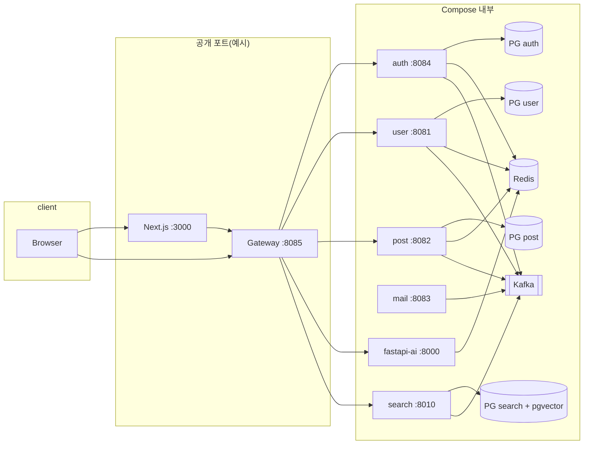

# MSA 블로그 플랫폼 — 표준 템플릿

<p align="center">
  <a href="README.md">← Hub</a>
  &nbsp;·&nbsp;
  <a href="README.en.md">English →</a>
</p>

---

## 이 프로젝트는 무엇인가요?

**Spring Cloud Gateway**를 단일 API 진입점으로 두고, 인증·회원·게시글·검색·AI 챗봇 등을 **독립 서비스**로 나눈 **MSA 블로그/콘텐츠 플랫폼** 예제입니다.  
PostgreSQL(스키마 분리·pgvector), Redis, **Kafka(KRaft)**, Next.js 프론트가 함께 구성되어 있으며, **4GB급 소형 VPS**(예: Lightsail)에서 동작하도록 메모리 상한을 잡아 두었습니다.

오픈소스 템플릿으로 **Fork → `.env`만 채우기 → 실행** 흐름을 목표로 합니다.

---

## 기술 스택

| 구분 | 기술 |
|------|------|
| API 게이트웨이 | Spring Cloud Gateway (WebFlux), JWT 1차 검증, Trace ID |
| 백엔드 | Spring Boot 3 (Auth, User, Post, SMTP), FastAPI (Search, AI) |
| 프론트엔드 | Next.js (App Router) |
| 데이터 | PostgreSQL 15 × 4(DB 분리), Redis, Kafka 3.7 KRaft |
| 인프라 | Docker Compose, GHCR, GitHub Actions 배포(선택) |

---

## 시스템 구조

브라우저와 SSR은 **Next.js(3000)** 가 사용자에게 응답하고, 브라우저·서버 컴포넌트의 API 호출은 **게이트웨이(8085)** 로 모입니다.  
백엔드 마이크로서비스는 Compose 네트워크 안에서만 노출(`expose`)되고, 대외 포트는 주로 **3000, 8085, (선택) 8000·8010·Kafka UI** 등입니다.



- **SMTP(mail-service)** 는 게이트웨이에 노출되지 않고, **Kafka 이벤트** 등을 통해 인증 메일 발송 등에 사용됩니다.
- **검색 서비스**는 Kafka로 게시글 변경을 소비해 임베딩을 갱신하고, pgvector로 유사도 검색을 수행합니다.

---

## 구성된 기능

- **회원 / 인증**: 이메일 코드 가입·로그인, JWT(Access/Refresh), 쿠키·Bearer, **OAuth2**(Google / Kakao / GitHub, 설정 시), 비밀번호·아이디 찾기 플로우
- **프로필**: 닉네임 중복 확인, 내 정보 조회 등 (user-service)
- **게시글**: 작성·수정·삭제, 목록·상세·카테고리·태그, 인기글, 키워드 검색(post), **임시글(draft)** · 발행
- **미디어**: 커버 이미지 업로드
- **댓글**: 작성·수정·삭제·목록
- **조회수**: 기록·통계 API
- **의미 검색**: `/api/search`, 연관 글 `/api/search/related`, 인덱스 동기화 API(게이트웨이 경유)
- **챗봇**: FastAPI + Groq(LangChain), 세션·관리자 확인 플로우 (`GROQ_API_KEY` 필요)
- **운영 보조**: autoheal(라벨), Kafka UI(`--profile tools`), Fluent Bit·node-exporter(모니터링 연동 가능)

---

## API 명세 (게이트웨이 기준)

**Base URL (로컬 예시):** `http://localhost:8085`  
실제 클라이언트는 Next의 `NEXT_PUBLIC_*` 로 동일 호스트를 가리키도록 맞춥니다.

### 라우팅 요약

| Prefix | 대상 서비스 | 설명 |
|--------|-------------|------|
| `/auth`, `/auth/**` | auth-service (`/auth` context-path) | 로그인·회원·토큰·OAuth 콜백 등 |
| `/user`, `/user/**` | user-service | 프로필·중복 확인 등 |
| `/api/posts`, `/api/posts/**` | post-service | 게시글·댓글·미디어·조회수 등 |
| `/api/post-drafts`, `/api/post-drafts/**` | post-service | 임시글 |
| `/chat`, `/chat/**` | fastapi-ai | 챗봇·헬스 |
| `/api/search`, `/api/search/**` | search-service | 검색·인덱스·연관 글 |
| `/actuator/**` | api-gateway | 헬스 등(노출 범위는 설정 따름) |

### Auth (`/auth` 접두 — 게이트웨이에서는 `/auth/...`)

| 메서드 | 경로 | 설명 |
|--------|------|------|
| POST | `/auth/send-code`, `/auth/verify-code` | 이메일 인증 코드 |
| POST | `/auth/signup`, `/auth/login`, `/auth/logout` | 회원가입·로그인·로그아웃 |
| POST | `/auth/refresh`, `/auth/extend` | 토큰 갱신·연장 |
| GET | `/auth/me` | 내 인증 정보 |
| POST | `/auth/find-username/send`, `/auth/find-username/verify` | 아이디 찾기 |
| POST | `/auth/reset-password/send`, `/auth/reset-password/verify` | 비밀번호 재설정 |
| * | `/auth/oauth2/**`, `/auth/login/oauth2/**` | OAuth2 (설정 시) |

### User (`/user`)

| 메서드 | 경로 | 설명 |
|--------|------|------|
| GET | `/user/check-username` | 아이디 중복 확인 (공개) |
| GET | `/user/check-nickname` | 닉네임 중복 확인 (공개) |
| GET | `/user/me` | 내 프로필 |
| POST | `/user/api/users/nicknames` | 닉네임 일괄 조회 등 |

### Posts (`/api/posts`, `/api/post-drafts`)

| 메서드 | 경로 | 설명 |
|--------|------|------|
| GET | `/api/posts` | 목록 (공개) |
| GET | `/api/posts/{id}` | 상세 (공개) |
| GET | `/api/posts/popular`, `/category`, `/tag`, `/search` | 인기·필터·검색 |
| GET | `/api/posts/categories`, `/tags` | 메타 |
| POST/PUT/DELETE | `/api/posts`, `/api/posts/{id}` | 작성·수정·삭제 (인증 필요) |
| POST | `/api/posts/media/upload` | 커버 업로드 |
| POST | `/api/posts/visits/record`, GET `/api/posts/visits/stats` | 조회수 |
| GET/POST | `/api/posts/{postId}/comments` | 댓글 |
| PUT/DELETE | `/api/posts/comments/{commentId}` | 댓글 수정·삭제 |
| * | `/api/post-drafts/**` | 임시글 CRUD·발행 |

### Search (`/api/search`)

| 메서드 | 경로 | 설명 |
|--------|------|------|
| GET | `/api/search?q=` | 의미 검색 |
| GET | `/api/search/related?post_id=` | 연관 글 |
| POST | `/api/search/index` | 인덱스 upsert |
| DELETE | `/api/search/index/{post_id}` | 인덱스 삭제 |

### Chat (`/chat`)

| 메서드 | 경로 | 설명 |
|--------|------|------|
| GET | `/chat/health` 또는 `/health` (프록시 후 경로) | 헬스 |
| POST | `/chat` | 대화 (본문은 FastAPI 스키마 따름) |

### JWT·공개 경로

게이트웨이 `JwtValidationGlobalFilter`에서 **일부 경로는 토큰 없이 허용**됩니다(로그인·목록·검색·챗봇 등).  
그 외 **쓰기/보호 API**는 `Authorization: Bearer` 또는 `authToken` 쿠키가 필요합니다. 세부 패턴은 코드 `PUBLIC_PATTERNS` 를 참고하세요.

상세 OpenAPI는 각 서비스에 따라 다릅니다. 게이트웨이는 **경로 프리픽스만 위와 같이 분기**합니다.

---

## Fork 후 바로 실행하기

### 요구 사항

- Docker Desktop 또는 Docker Engine + **Compose V2** (`docker compose`)
- 권장 RAM: **전체 스택 기준 4GB+** (메모리 부족 시 일부 서비스만 켜는 식으로 조정 가능)

### 1) 저장소 복제

```bash
git clone https://github.com/YOUR_USERNAME/YOUR_REPO.git
cd YOUR_REPO
```

### 2) 환경 변수

```bash
bash scripts/init-env.sh
```

- 루트 `.env.example` → `.env` 복사
- `frontend/nextjs-app/.env.production.example` → `.env.production` (없을 때만)

`.env` 에서 최소 **반드시** 바꿀 것을 권장합니다.

- `POSTGRES_PASSWORD`, `JWT_SECRET` (긴 랜덤)
- 로컬: `CORS_ALLOWED_ORIGINS`, `FRONTEND_URL`, `NEXT_PUBLIC_*` (기본은 localhost)
- OAuth·메일·챗봇: `OAUTH2_*`, `MAIL_*`, `GROQ_API_KEY` 등 (미사용 시 비워 두거나 기본값)

전체 키 설명: **`.env.example`** 참고.

### 3) 전체 기동 (로컬 이미지 빌드)

```bash
chmod +x scripts/*.sh   # 선택
bash scripts/local-up.sh
```

- 프론트: **http://localhost:3000**
- 게이트웨이: **http://localhost:8085**

### 4) 프론트만 로컬 개발(`npm run dev`)할 때

백엔드는 Docker로 띄운 뒤:

```bash
cd frontend/nextjs-app
cp .env.example .env.local
npm ci && npm run dev
```

`GATEWAY_INTERNAL_URL` 등은 `.env.example` 주석 참고.

### 5) Git에 올리면 안 되는 것

`.env`, 키 파일, `data/`, `**/target/`, `node_modules/`, `.next/` 등은 **`.gitignore`** 로 제외됩니다. 커밋 전 `git status` 로 확인하세요.

---

## CI/CD (GitHub Actions → GHCR → 서버)

- 워크플로: **`.github/workflows/deploy.yml`**
- `main` / `master` **push** 시: 러너에서 이미지 **빌드·푸시(GHCR)** → SSH로 서버에 `.env` 동기화 후 `git pull`, `docker compose pull`, `up`
- Secrets: `ENV_VARS`, `HOST`, `USERNAME`, `KEY`, (선택) `DEPLOY_PATH`

**로컬 맥에서 빌드한 이미지는 자동으로 서버에 가지 않습니다.** 배포는 **push로 트리거되는 클라우드 빌드**를 사용합니다.

자세한 절차: **`docs/로컬-실행-및-배포-가이드.md`**, **`docs/서버-재배포-및-Docker정리.md`**, **`docs/GitHub-공개저장소-CI-CD-가이드.md`**

서버 디스크·캐시 정리: **`scripts/server-docker-cleanup.sh`**

---

## 주요 포트 (호스트 기준, 기본 compose)

| 포트 | 용도 |
|------|------|
| 3000 | Next.js |
| 8085 | API Gateway |
| 5432–5435 | PostgreSQL (user / post / auth / search) |
| 6379 | Redis |
| 9092 | Kafka |
| 8000 | FastAPI AI (직접 노출) |
| 8010 | Search API (직접 노출) |
| 8080 | Kafka UI (`docker compose --profile tools up -d`) |

---

## 문서 목록

| 문서 | 내용 |
|------|------|
| `docs/로컬-실행-및-배포-가이드.md` | 로컬·운영 실행, 트러블슈팅 |
| `docs/서버-재배포-및-Docker정리.md` | GHCR 전환, 정리, CI 연계 |
| `docs/GitHub-공개저장소-CI-CD-가이드.md` | 공개 저장소 CI/CD |
| `docs/Nginx-운영-가이드.md` | Nginx 템플릿·렌더 |

---

## 라이선스

저장소에 `LICENSE` 파일이 없다면 Fork 후 사용 목적에 맞는 라이선스를 추가하는 것을 권장합니다.

---

<p align="center">
  <a href="README.md">← Hub</a>
  &nbsp;·&nbsp;
  <a href="README.en.md">English →</a>
</p>
