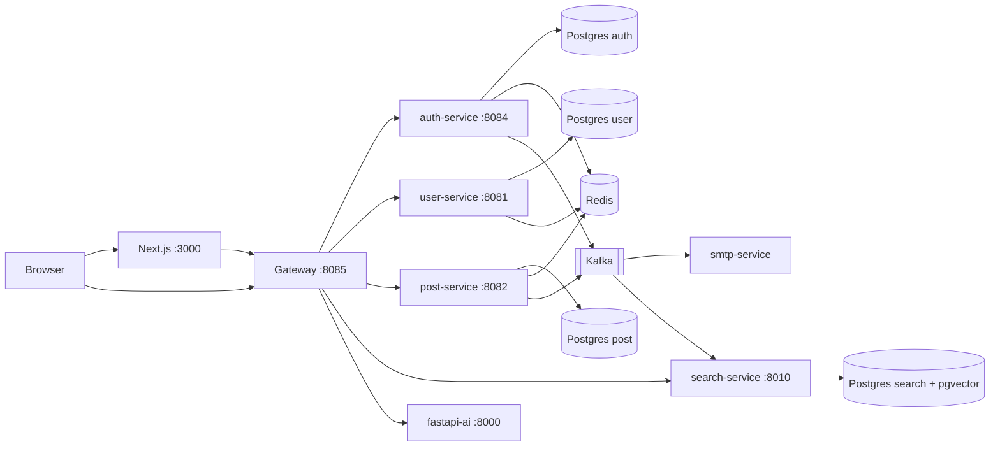
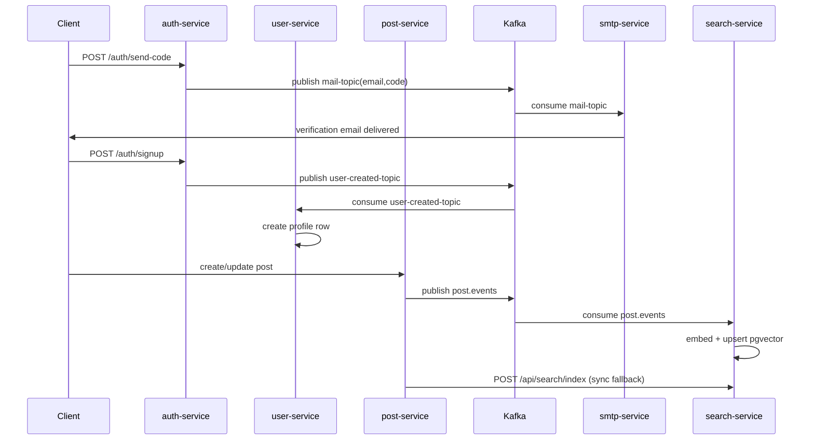
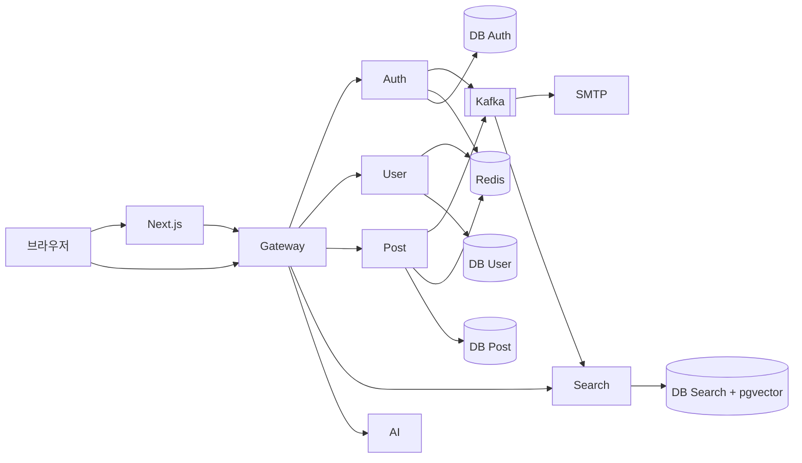

# MSA Blog Platform Template

Fork this template and build your own production-ready blog with MSA, Kafka, JWT/OAuth, hybrid search, and CI/CD in minutes.

<p align="center">
  <a href="#english">English</a>
  &nbsp;|&nbsp;
  <a href="#한국어">한국어</a>
</p>

## Demo Video

> Place your demo file at `./블로그 실행 영상.mov` (or update the path below).

<video src="./demo_video.gif" controls loop muted playsinline width="100%"></video>

---

## English

### Project Overview

This is an open-source **MSA blog platform template** based on:

- **Gateway**: Spring Cloud Gateway (`/auth`, `/user`, `/api/posts`, `/api/search`, `/chat`)
- **Core Services**: Auth, User, Post, SMTP(Mail), Search(FastAPI + pgvector), AI(FastAPI + Groq)
- **Infra**: PostgreSQL (split DBs), Redis, Kafka(KRaft), Docker Compose
- **Frontend**: Next.js App Router
- **Deployment**: GitHub Actions -> GHCR -> server (`docker compose up -d --pull always`)

### Full Feature List (Category-based)

#### 1) UI/UX

- Dark/Light theme toggle
- Sidebar with categories and tags (with post counts)
- Full-screen search overlay
- System structure page with clickable nodes that trigger related post search

#### 2) Authentication & Account

- Email verification signup (Kafka async mail delivery + SMTP consumer)
- OAuth login: Google, Kakao, GitHub
- JWT access token + refresh token
- Auto/session extension endpoint (`/auth/extend`)
- Logout + refresh invalidation in Redis
- Username recovery and password reset with verification code

#### 3) Posts & Content

- Post CRUD
- Draft CRUD + publish flow
- Draft-from-existing-post flow and latest draft lookup
- Category/tag taxonomy with counts
- Popular posts (by views)
- Thumbnail upload (image/video) with default fallback when absent

#### 4) Comments

- Comment CRUD
- Nested reply comments (`parentCommentId` tree)
- Authenticated users only for write actions

#### 5) Search

- **Hybrid search**:
  - SQL keyword search (`/api/posts/search`)
  - Semantic vector search (`/api/search`)
  - Frontend merge + dedup + ranking priority
- Related posts by vector similarity (`/api/search/related`)

#### 6) AI Assistant

- FastAPI chatbot using Groq model
- Session memory and clear endpoint (`/chat/clear`)
- Optional protected memory-save flow with admin password gate

#### 7) DevOps / Operations

- Docker Compose local and production operation
- CI/CD workflow with selective image build and unchanged-image retag
- Optional monitoring helpers: Fluent Bit, node-exporter, Kafka UI profile
- Autoheal for unhealthy containers

### MSA Server Feature Mapping

| Service | Main Responsibilities |
|---|---|
| `api-gateway` | Single ingress, path routing, JWT validation filter, CORS handling |
| `auth-service` | Signup/signin/logout, refresh/extend, OAuth callbacks, verification code logic, emits `mail-topic` and `user-created-topic` |
| `user-service` | User profile DB, nickname/username checks, consumes `user-created-topic` |
| `post-service` | Post/draft/comment/media/visit APIs, keyword search, publishes `post.events`, triggers sync indexing to search-service |
| `smtp-service` | Consumes `mail-topic`, sends SMTP mail |
| `search-service` | FastAPI search API, pgvector index storage, consumes `post.events` |
| `fastapi-ai` | Chat endpoint, session memory, Groq integration |
| `frontend` | Next.js UI, auth flows, write UI, hybrid search orchestration |

### Architecture (Mermaid)



### Kafka Event Flow



### Run with Docker Compose

```bash
git clone https://github.com/YOUR_USERNAME/YOUR_REPO.git
cd YOUR_REPO
bash scripts/init-env.sh
bash scripts/local-up.sh
```

Access:

- Frontend: `http://localhost:3000`
- Gateway: `http://localhost:8085`

### `.env.example` (Required Variables)

```bash
# Must change
POSTGRES_PASSWORD=change-me-strong-password
JWT_SECRET=change-me-min-32-chars-base64-or-long-random-string

# Core URLs
FRONTEND_URL=http://localhost:3000
CORS_ALLOWED_ORIGINS=http://localhost:3000,http://127.0.0.1:3000
OAUTH2_REDIRECT_BASE=http://localhost:8085

# Optional integrations
OAUTH2_GOOGLE_CLIENT_ID=
OAUTH2_GOOGLE_CLIENT_SECRET=
OAUTH2_KAKAO_CLIENT_ID=
OAUTH2_KAKAO_CLIENT_SECRET=
OAUTH2_GITHUB_CLIENT_ID=
OAUTH2_GITHUB_CLIENT_SECRET=
MAIL_USERNAME=
MAIL_PASSWORD=
GROQ_API_KEY=
```

### Project Structure

```text
.
├─ backend/
│  ├─ gateway-service/
│  ├─ auth-service/
│  ├─ user-service/
│  ├─ post-service/
│  ├─ smtp-service/
│  ├─ search-service/
│  └─ fastapi-ai/
├─ frontend/
│  └─ nextjs-app/
├─ monitoring/
├─ nginx/
├─ scripts/
├─ docs/
├─ docker-compose.yml
└─ .env.example
```

### API Specification (Gateway Base: `http://localhost:8085`)

| Domain | Method | Path | Description |
|---|---|---|---|
| Auth | POST | `/auth/send-code`, `/auth/verify-code` | Email verification |
| Auth | POST | `/auth/signup`, `/auth/login`, `/auth/logout` | Signup/signin/logout |
| Auth | POST | `/auth/refresh`, `/auth/extend` | Token refresh/session extension |
| Auth | GET | `/auth/me` | Current auth user |
| Auth | POST | `/auth/find-username/send`, `/auth/find-username/verify` | Username recovery |
| Auth | POST | `/auth/reset-password/send`, `/auth/reset-password/verify` | Password reset |
| User | GET | `/user/check-username`, `/user/check-nickname` | Availability checks |
| User | GET | `/user/me` | My profile |
| User | POST | `/user/api/users/nicknames` | Batch nickname lookup |
| Post | GET | `/api/posts`, `/api/posts/{id}` | List/detail |
| Post | POST/PUT/DELETE | `/api/posts`, `/api/posts/{id}` | Create/update/delete |
| Post | GET | `/api/posts/popular`, `/api/posts/category`, `/api/posts/tag`, `/api/posts/search` | Popular/filter/keyword search |
| Post | GET | `/api/posts/categories`, `/api/posts/tags` | Taxonomy with counts |
| Draft | `*` | `/api/post-drafts/**` | Draft CRUD + publish |
| Media | POST | `/api/posts/media/upload` | Cover upload (image/video) |
| Comment | GET/POST | `/api/posts/{postId}/comments` | Comment list/create |
| Comment | PUT/DELETE | `/api/posts/comments/{commentId}` | Comment update/delete |
| Visit | POST/GET | `/api/posts/visits/record`, `/api/posts/visits/stats` | Visit metrics |
| Search | GET | `/api/search`, `/api/search/related` | Semantic search/related |
| Search | POST/DELETE | `/api/search/index`, `/api/search/index/{post_id}` | Index upsert/delete |
| AI | POST | `/chat` | Chat endpoint |
| AI | GET | `/chat/health`, `/health` | Health check |

### Hybrid Search Structure (pgvector + keyword)

1. `post-service` exposes SQL keyword search (`/api/posts/search`)
2. `search-service` embeds text and stores vectors in pgvector (`/api/search`)
3. Frontend calls both in parallel and merges deduplicated results
4. Keyword results are prioritized, semantic-only hits are appended

### Why MSA for This Blog?

- Independent deployability of auth/post/search/ai/mail domains
- Fault isolation (mail/search issues do not fully block post reads)
- Technology fit per domain (Spring Boot + FastAPI mixed stack)
- Event-driven scalability using Kafka (`mail-topic`, `user-created-topic`, `post.events`)
- Easier future extension (new recommendation/moderation service without monolith rewrite)

---

## 한국어

### 프로젝트 소개

이 프로젝트는 **MSA 기반 블로그 템플릿**입니다.  
Fork 후 `.env`만 채우면 Docker Compose로 바로 실행하고, GitHub Actions 기반 CI/CD까지 연결할 수 있습니다.

### 전체 기능 정리 (카테고리별)

#### 1) UI/UX

- 다크/라이트 모드 전환
- 카테고리/태그 개수 표시 사이드바
- 전체 화면 검색 오버레이
- 구조도 페이지에서 노드 클릭 시 관련 글 검색 연결

#### 2) 회원/인증

- Kafka 비동기 기반 이메일 인증 회원가입 + SMTP 발송
- OAuth 로그인(구글/카카오/깃허브)
- JWT Access/Refresh, 세션 연장(`/auth/extend`)
- 로그아웃 시 Redis Refresh 무효화
- 아이디 찾기/비밀번호 재설정 인증 플로우

#### 3) 포스트

- 게시글 CRUD
- 임시저장(Draft) CRUD + 게시(Publish)
- 기존 글 기준 임시저장본 생성/조회
- 카테고리/태그 관리 및 개수 집계
- 조회수 기반 인기글
- 썸네일 이미지/동영상 업로드, 미설정 시 기본 썸네일

#### 4) 댓글

- 댓글 CRUD
- 대댓글(트리) 지원
- 작성 계정 권한 검증

#### 5) 검색

- **하이브리드 검색**
  - SQL 키워드 검색(`/api/posts/search`)
  - pgvector 의미 검색(`/api/search`)
  - 프론트에서 병합/중복제거/우선순위 정렬
- 연관글 검색(`/api/search/related`)

#### 6) 챗봇

- FastAPI + Groq 기반 블로그 어시스턴트
- 세션 메모리 및 초기화(`/chat/clear`)
- 민감 정보 저장 시 관리자 비밀번호 검증 플로우

#### 7) 배포/운영

- Docker Compose 기반 로컬/운영 실행
- Git 기반 선택적 CI 빌드 + GHCR 리태깅
- Fluent Bit, node-exporter, Kafka UI(옵션)
- Autoheal 기반 헬스체크 재기동

### MSA 서버별 기능 매핑

| 서버 | 담당 기능 |
|---|---|
| `api-gateway` | 단일 진입점, 경로 라우팅, JWT 검증 필터, CORS |
| `auth-service` | 회원가입/로그인/토큰, OAuth, 인증코드, `mail-topic`, `user-created-topic` 발행 |
| `user-service` | 사용자 프로필/중복 확인, `user-created-topic` 소비 |
| `post-service` | 게시글/임시글/댓글/미디어/조회수, 키워드 검색, `post.events` 발행 |
| `smtp-service` | `mail-topic` 소비 후 SMTP 발송 |
| `search-service` | 의미 검색 API, pgvector 인덱스 관리, `post.events` 소비 |
| `fastapi-ai` | 챗봇 API, 세션 메모리, Groq 연동 |
| `frontend` | Next.js UI, 글 작성 화면, 하이브리드 검색 결합 |

### 시스템 구조도 (Mermaid)



### 실행 방법 (docker-compose 기준)

```bash
git clone https://github.com/YOUR_USERNAME/YOUR_REPO.git
cd YOUR_REPO
bash scripts/init-env.sh
bash scripts/local-up.sh
```

- 서비스: `http://localhost:3000`
- 게이트웨이: `http://localhost:8085`

### 환경 변수 (`.env.example`)

```bash
POSTGRES_PASSWORD=change-me-strong-password
JWT_SECRET=change-me-min-32-chars-base64-or-long-random-string
FRONTEND_URL=http://localhost:3000
CORS_ALLOWED_ORIGINS=http://localhost:3000,http://127.0.0.1:3000
OAUTH2_REDIRECT_BASE=http://localhost:8085
MAIL_USERNAME=
MAIL_PASSWORD=
GROQ_API_KEY=
```

### 프로젝트 구조

```text
backend/{gateway-service,auth-service,user-service,post-service,smtp-service,search-service,fastapi-ai}
frontend/nextjs-app
monitoring
nginx
scripts
docs
docker-compose.yml
.env.example
```

### API 명세 (Gateway 기준)

- Auth: `/auth/send-code`, `/auth/verify-code`, `/auth/signup`, `/auth/login`, `/auth/logout`, `/auth/refresh`, `/auth/extend`, `/auth/me`
- 계정 복구: `/auth/find-username/send`, `/auth/find-username/verify`, `/auth/reset-password/send`, `/auth/reset-password/verify`
- User: `/user/check-username`, `/user/check-nickname`, `/user/me`, `/user/api/users/nicknames`
- Post: `/api/posts`, `/api/posts/{id}`, `/api/posts/popular`, `/api/posts/category`, `/api/posts/tag`, `/api/posts/search`, `/api/posts/categories`, `/api/posts/tags`
- Draft: `/api/post-drafts/**`
- Comment: `/api/posts/{postId}/comments`, `/api/posts/comments/{commentId}`
- Media/Visit: `/api/posts/media/upload`, `/api/posts/visits/record`, `/api/posts/visits/stats`
- Search: `/api/search`, `/api/search/related`, `/api/search/index`, `/api/search/index/{post_id}`
- AI: `/chat`, `/chat/health`, `/health`

### Kafka 이벤트 흐름 요약

- 회원가입/인증코드: `auth-service` -> `mail-topic` -> `smtp-service`
- 회원 생성 동기화: `auth-service` -> `user-created-topic` -> `user-service`
- 검색 인덱싱: `post-service` -> `post.events` -> `search-service` (동시에 HTTP 동기 인덱싱 보완)

### 검색 구조 (pgvector + hybrid)

1. `post-service`에서 키워드 검색(SQL)
2. `search-service`에서 임베딩 기반 벡터 검색(pgvector)
3. 프론트에서 병렬 호출 후 통합/중복 제거
4. 키워드 결과 우선 + 의미 결과 보강

### Why MSA (설계 이유)

- 인증/게시글/검색/챗봇/메일 도메인 분리로 독립 배포 가능
- 장애 격리와 확장성 확보
- 도메인별 최적 기술 선택(Spring + FastAPI 혼합)
- Kafka 이벤트 기반 비동기 처리로 응답성/유지보수성 향상
- 템플릿 확장 시 신규 서비스 추가가 용이
